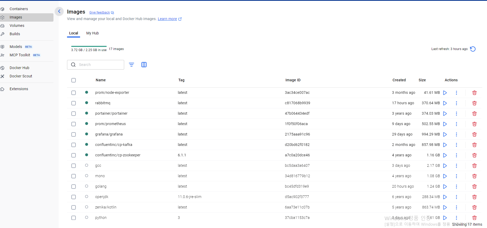
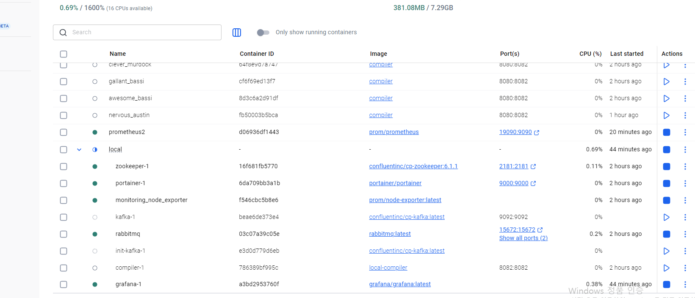
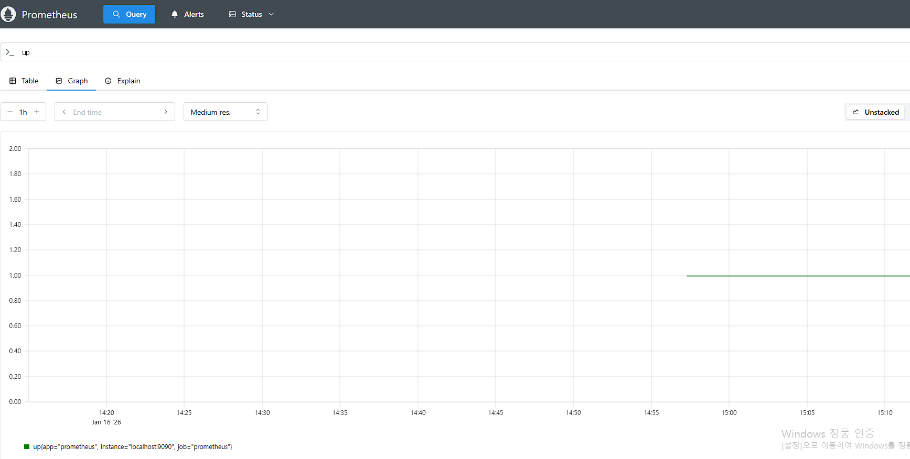
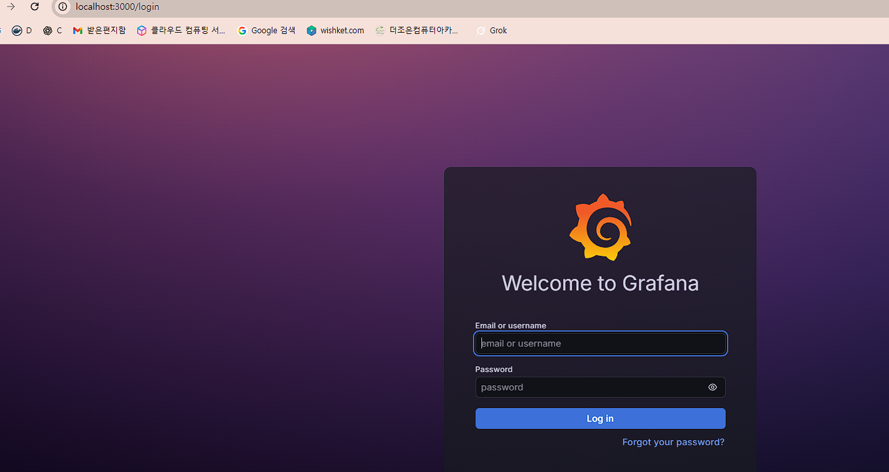
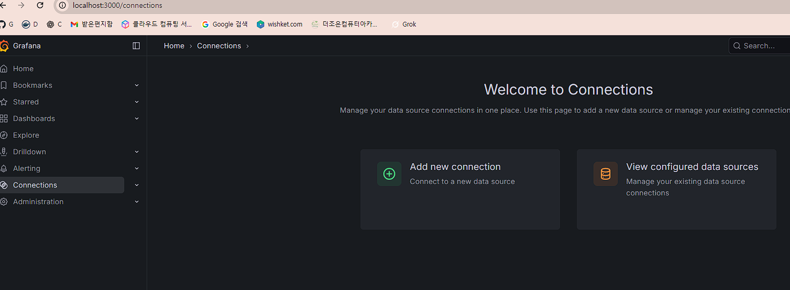
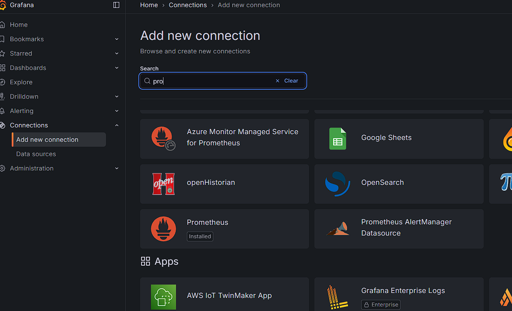
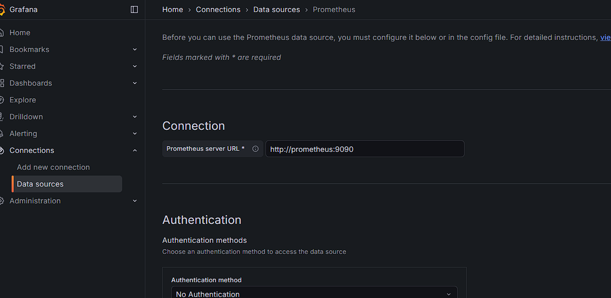
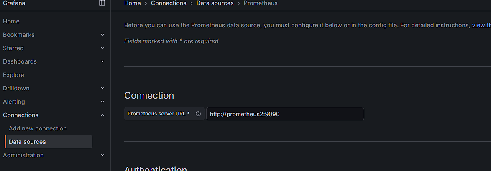
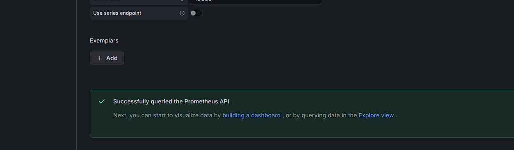
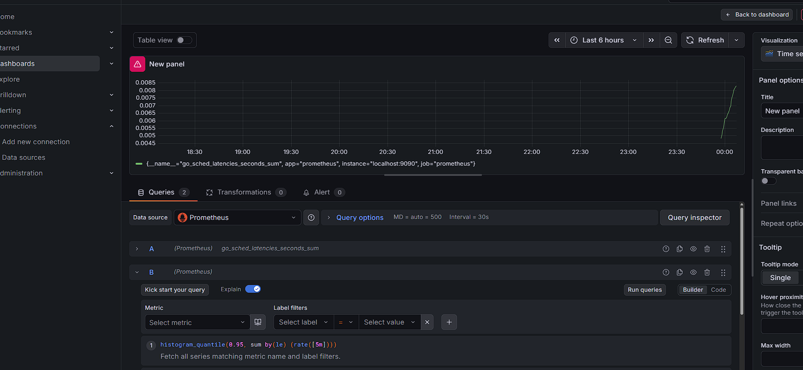

# Remote Code Compiler

## 사전에 WSL(WSL2) 설치/관리 + 여러 리눅스 배포판 설치 + Docker Desktop(WSL2) 공유 정리

> 기준: Windows 10/11에서 **WSL2**를 사용하는 일반적인 케이스  
> PowerShell(관리자 권한)에서 실행해야 하는 명령은 ✅로 표시했습니다.

---

## 0) 빠른 결론 (Docker Desktop + WSL2)
- **Docker Desktop + WSL2 백엔드 + WSL Integration 사용**이면  
  → Windows와 WSL Linux는 **같은 Docker 엔진을 공유**하므로 **이미지/컨테이너가 공유**됩니다.
- WSL Ubuntu 안에 **docker-ce를 별도로 설치**하고 그 안에서 `dockerd`를 따로 띄우면  
  → Docker Desktop 엔진과 **분리**되어 **공유되지 않습니다.**

---

## 1) WSL/WSL2 설치 (가장 쉬운 방법)
### 1-1) WSL 설치/기본 세팅 (권장)
✅ **PowerShell(관리자)**:
```powershell
wsl --install
```

- 기본으로 Ubuntu가 함께 설치되는 경우가 많습니다.
- 설치 후 재부팅이 필요할 수 있어요.

### 1-2) WSL 상태/버전 확인
```powershell
wsl --status
```

### 1-3) WSL 업데이트 (커널 업데이트)
✅ PowerShell(관리자):
```powershell
wsl --update
```

### 1-4) 기본 WSL 버전을 WSL2로 지정
```powershell
wsl --set-default-version 2
```

---

## 2) 설치 가능한 리눅스 목록 조회 & 여러 배포판 설치
### 2-1) 설치 가능한 배포판(온라인) 목록 보기
```powershell
wsl --list --online
# 또는 축약
wsl -l -o
```

### 2-2) 원하는 배포판 설치
예: Ubuntu / Debian / Kali / openSUSE 등
```powershell
wsl --install -d Ubuntu
wsl --install -d Debian
wsl --install -d kali-linux
```

> 배포판 이름은 `wsl -l -o` 결과에 표시된 이름을 그대로 쓰면 됩니다.

---

## 3) 현재 설치된 WSL 배포판 목록 보기 (설치 목록)
### 3-1) 설치된 배포판 목록
```powershell
wsl --list
# 축약
wsl -l
```

### 3-2) 설치된 배포판 + WSL 버전(1/2)까지 보기 (추천)
```powershell
wsl --list --verbose
# 축약
wsl -l -v
```

---

## 4) 실행/접속/기본 배포판 관리
### 4-1) 특정 배포판 실행(접속)
```powershell
wsl -d Ubuntu
wsl -d Debian
```

### 4-2) 특정 배포판에서 특정 명령만 실행
```powershell
wsl -d Ubuntu -- uname -a
wsl -d Debian -- cat /etc/os-release
```

### 4-3) 기본 배포판 지정
```powershell
wsl --set-default Ubuntu
```

### 4-4) 실행 중인 배포판 종료
- 전체 WSL 종료:
```powershell
wsl --shutdown
```

- 특정 배포판만 종료:
```powershell
wsl --terminate Ubuntu
```

---

## 5) WSL1 ↔ WSL2 변환/설정
### 5-1) 특정 배포판을 WSL2로 변경
```powershell
wsl --set-version Ubuntu 2
```

### 5-2) 특정 배포판을 WSL1로 변경(특수 목적)
```powershell
wsl --set-version Ubuntu 1
```

---

## 6) 배포판(리눅스) 삭제/백업/복원
### 6-1) 배포판 완전 삭제(주의!)
```powershell
wsl --unregister Ubuntu
```
> ⚠️ 해당 배포판의 파일시스템/데이터가 모두 삭제됩니다.

### 6-2) 배포판 백업(export)
```powershell
wsl --export Ubuntu C:\backup\ubuntu.tar
```

### 6-3) 배포판 복원(import) - 새 이름으로 가져오기
```powershell
wsl --import UbuntuRestored C:\WSL\UbuntuRestored C:\backup\ubuntu.tar --version 2
```

---

## 7) Windows ↔ WSL 파일 경로/접근
### 7-1) WSL에서 Windows 드라이브 접근
- C드라이브:
```bash
cd /mnt/c
```

### 7-2) Windows 탐색기에서 WSL 파일 보기
- 탐색기 주소창에 입력:
```text
\\wsl$\Ubuntu
```

### 7-3) 현재 WSL 디렉터리를 Windows 탐색기로 열기
WSL(리눅스)에서:
```bash
explorer.exe .
```

---

## 8) 네트워크/포트 관련 빠른 팁
- WSL2는 내부적으로 가상 네트워크를 쓰므로 IP가 달라질 수 있어요.
- 보통은 `localhost` 포트 포워딩이 동작하지만, 방화벽/보안 설정에 따라 예외가 있을 수 있습니다.
- WSL에서 현재 IP 확인:
```bash
ip addr
```

---

## 9) 자주 쓰는 “운영” 명령 모음 (치트시트)
### 9-1) 현재 설치/실행 현황 빠르게 보기
```powershell
wsl -l -v
wsl --status
```

### 9-2) 특정 배포판에서 패키지 업데이트 (Ubuntu/Debian)
WSL(리눅스) 안에서:
```bash
sudo apt update
sudo apt upgrade -y
```

### 9-3) openSUSE 계열 예시
```bash
sudo zypper refresh
sudo zypper update -y
```

---

## 10) Docker Desktop + WSL2 “공유 엔진” 확인
### 10-1) WSL Ubuntu에서 Docker Desktop 엔진을 보는지 확인
WSL Ubuntu에서:
```bash
docker info | grep -E "Server Version|Operating System"
```

- Docker Desktop(WSL2) 관련 정보가 나오면 보통 **공유 엔진**입니다.

### 10-2) Windows에서도 같은지 확인
PowerShell에서:
```powershell
docker images
docker ps
```

---

## 11) 흔한 문제 2가지
### 11-1) “WSL이 설치는 됐는데 배포판이 없음”
- `wsl -l -o`로 목록 확인 후 `wsl --install -d <배포판명>` 실행

### 11-2) Docker 이미지가 공유가 안 되는 것 같음
- WSL Ubuntu에 `docker-ce`를 직접 설치해서 엔진을 따로 돌리고 있으면 공유가 안 됩니다.
- Docker Desktop 설정에서:
  - WSL2 백엔드 사용
  - WSL Integration에서 해당 배포판(예: Ubuntu) 체크
를 확인하세요.

---

## 12) (선택) 성능/리소스 튜닝 팁
WSL2 리소스 제한은 `C:\Users\<사용자>\.wslconfig`로 조정할 수 있습니다. (파일이 없으면 생성)

예시:
```ini
[wsl2]
memory=8GB
processors=4
swap=4GB
```

적용:
```powershell
wsl --shutdown
```
후 다시 WSL 실행하면 적용됩니다.

---


온라인 코드 컴파일러로 **Java**, **Kotlin**, **C**, **C++**, **C#**, **Golang**, **Python**, **Scala**, **Ruby**, **Rust**, **Haskell** 총 11개 언어를 지원합니다. 이 도구는 Docker 컨테이너를 사용해 실행 환경을 격리하며, 원격으로 코드를 컴파일/실행합니다.


REST 호출(롱 폴링/푸시 알림), **Apache Kafka**, **RabbitMQ**, **gRPC**까지 다양한 통신 방식을 지원합니다.

## 목차
- [보안 고려사항](#보안-고려사항)
  - [샌드박싱](#샌드박싱)
  - [리소스 제한](#리소스-제한)
  - [입력 값 정제](#입력-값-정제)
  - [요청 제한](#요청-제한)
- [가비지 컬렉션](#가비지-컬렉션)
- [확장성](#확장성)
- [동작 방식](#동작-방식)
- [벤치마크 리포트](#벤치마크-리포트)
  - [개요](#개요)
  - [테스트 환경](#테스트-환경)
  - [컴파일 성능](#컴파일-성능)
  - [실행 성능](#실행-성능)
  - [관찰 결과](#관찰-결과)
- [사전 준비](#사전-준비)
- [JAR 빌드](#jar-빌드)
- [시작하기](#시작하기)
- [로컬 실행(개발 환경 전용)](#로컬-실행개발-환경-전용)
- [K8s 배포](#k8s-배포)
- [API](#api)
  - [REST 호출 예시](#rest-호출-예시)
  - [Verdict 목록](#verdict-목록)
  - [UI에서 사용하기](#ui에서-사용하기)
  - [푸시 알림](#푸시-알림)
  - [멀티파트 요청](#멀티파트-요청)
  - [gRPC 사용](#grpc-사용)
- [Docker 이미지/컨테이너 정보 시각화](#docker-이미지컨테이너-정보-시각화)
- [Kafka Streams 스트림 처리](#kafka-streams-스트림-처리)
- [RabbitMQ 큐잉 시스템](#rabbitmq-큐잉-시스템)
- [모니터링](#모니터링)
- [로깅](#로깅)
- [도움 받기](#도움-받기)
- [저자](#저자)

## 보안 고려사항
컴파일러는 실행 환경을 샌드박싱하고 엄격한 리소스 제한을 적용하며, 입력값 검증을 통해 코드 주입 공격을 방지합니다.

#### 샌드박싱
각 실행은 전용 Docker 컨테이너에서 수행되며 시스템 자원으로부터 격리됩니다. 이를 통해 권한 없는 접근을 방지하고 잠재적인 보안 취약점을 완화합니다.

#### 리소스 제한
CPU/메모리/실행 시간에 대한 제한을 두어 자원 고갈 공격(DoS)을 방지하고 안정적인 플랫폼 운영을 보장합니다.

#### 입력 값 정제
사용자 입력을 실행 전에 검증 및 정제하여 악성 코드 실행 위험을 낮추고 실행 환경의 무결성을 유지합니다.

#### 요청 제한
기본적으로 **사용자 ID당 초당 5건(RPS)** 요청 제한이 적용됩니다. 필요 시 `MAX_USER_REQUESTS` 환경 변수를 변경해 조정할 수 있습니다.

## 가비지 컬렉션
주기적으로 정체된 실행과 관련 리소스를 정리하여 누수를 방지하고 효율적인 리소스 사용을 유지합니다.

## 확장성
인스턴스를 수평 확장하고 로드 밸런서 뒤에 배치해 고가용성과 높은 처리량을 제공합니다.

## 동작 방식
요청이 들어오면 먼저 코드 컴파일 전용 컨테이너를 생성하고, 메인 애플리케이션과 스토리지를 공유합니다. 컴파일이 성공하면 각 테스트 케이스를 위한 별도 실행 컨테이너를 만들어 격리된 환경에서 병렬 실행합니다.


<p>
  실행 단계에서 각 컨테이너는 동일한 CPU 할당량(권장 0.1 CPU/실행), 메모리 제한, 실행 시간 제한이 설정됩니다.
  메모리 한도 또는 실행 시간 초과 시 컨테이너가 자동 종료되며, 종료 원인을 사용자에게 반환합니다.
</p>

## 벤치마크 리포트

### 개요
Codeforces의 [Watermelon (Contest 4, A)](https://codeforces.com/contest/4/problem/A) 문제로 벤치마크를 수행했습니다.
Java, Python, C, C++ 4개 언어에서 10개 테스트 케이스를 각 4000회 실행하여 총 40000회 실행, 3000회 컴파일을 수행했습니다.

### 테스트 환경
- **메모리**: 8 GiB
- **vCPU**: 4 vCPU

### 컴파일 성능
#### 컴파일 시간 분석
- **최대 컴파일 시간**: 0.950406434 s
- **평균 컴파일 시간**: 0.82969625775 s
- **95퍼센타일 컴파일 시간**: 0.912345678 s

> *비고: 컴파일 시간에는 컨테이너 생성 시간이 포함됩니다.*

#### 컴파일 시간 분포
| 언어 | 최대(초) | 평균(초) | 95퍼센타일(초) |
|---|---:|---:|---:|
| Java | 0.950406434 | 0.82969625775 | 0.912345678 |
| Python | N/A | N/A | N/A |
| C | 0.812345678 | 0.78912345678 | 0.805678912 |
| C++ | 0.834567890 | 0.81234567890 | 0.825678901 |

*Python은 인터프리터 언어이므로 별도의 컴파일 단계가 없습니다.*

### 실행 성능
#### 실행 시간 분석
- **최대 실행 시간(단일 테스트)**: 0.601810192 s
- **평균 실행 시간(단일 테스트)**: 0.52991365113 s
- **95퍼센타일 실행 시간(단일 테스트)**: 0.589123456 s

테스트 케이스가 10개이므로 총 실행 시간은 다음과 같습니다.
- **총 실행 시간(전체 테스트)**: 10 × 0.52991365113 s = 5.2991365113 s

> *비고: 실행 시간에는 컨테이너 생성 및 실행 시간이 포함됩니다.*

#### 실행 시간 분포
| 언어 | 최대(초) | 평균(초) | 95퍼센타일(초) |
|---|---:|---:|---:|
| Java | 0.601810192 | 0.52991365113 | 0.589123456 |
| Python | 0.701234567 | 0.62345678912 | 0.689123456 |
| C | 0.498765432 | 0.45678901234 | 0.478901234 |
| C++ | 0.512345678 | 0.46789012345 | 0.489012345 |

### 관찰 결과


- **Java**는 컴파일 시간이 비교적 길지만 실행 성능은 안정적입니다.
- **Python**은 컴파일이 없지만 실행 시간이 길게 나타납니다.
- **C/C++**는 컴파일과 실행 모두에서 높은 성능을 보입니다.
- 95퍼센타일 지표는 대부분의 케이스에서 안정적인 처리 성능을 보여줍니다.

## 사전 준비
이 프로젝트를 실행하려면 Docker 엔진이 필요합니다.

## JAR 빌드
Maven으로 Java 소스와 애플리케이션 JAR를 빌드합니다.

```shell
mvn -s .mvn/settings.xml -DskipTests package
```

Maven Central 접근에 HTTP 프록시가 필요한 경우 `.mvn/settings.xml`의 호스트/포트를 환경에 맞게 조정하세요.

## 시작하기

1) Docker 이미지 빌드

```shell
docker image build . -t compiler
```

2) 볼륨 생성

```shell
docker volume create compiler
```

3) 컴파일러가 사용하는 이미지 빌드

```shell
./environment/build.sh
```
```powershell
Set-ExecutionPolicy -Scope Process Bypass
cd environment
.\pbuild.ps1
```
---
```
& mvn package -f "c:\edumgt-test\rcc\pom.xml" -DskipTests
```

4) 컨테이너 실행

```powershell
docker build -t compiler .
```

```
docker run --rm -p 8080:8082 `
  -v /var/run/docker.sock:/var/run/docker.sock `
  -e DELETE_DOCKER_IMAGE=true `
  -e EXECUTION_MEMORY_MAX=10000 `
  -e EXECUTION_MEMORY_MIN=0 `
  -e EXECUTION_TIME_MAX=15 `
  -e EXECUTION_TIME_MIN=0 `
  -e MAX_REQUESTS=1000 `
  -e MAX_EXECUTION_CPUS=0.2 `
  -e COMPILATION_CONTAINER_VOLUME=compiler `
  compiler
```

```shell
docker container run -p 8080:8082 -v /var/run/docker.sock:/var/run/docker.sock -v compiler:/compiler -e DELETE_DOCKER_IMAGE=true -e EXECUTION_MEMORY_MAX=10000 -e EXECUTION_MEMORY_MIN=0 -e EXECUTION_TIME_MAX=15 -e EXECUTION_TIME_MIN=0 -e MAX_REQUESTS=1000 -e MAX_EXECUTION_CPUS=0.2 -e COMPILATION_CONTAINER_VOLUME=compiler -t compiler
```

- **DELETE_DOCKER_IMAGE**: 기본값 `true`로, 컨테이너 실행 후 이미지가 삭제됩니다.
- **EXECUTION_MEMORY_MAX/MIN**: 요청에 허용되는 메모리 제한 범위(기본 최대 10,000MB, 최소 0MB).
- **EXECUTION_TIME_MAX/MIN**: 요청에 허용되는 실행 시간 제한 범위(기본 최대 15초, 최소 0초).
- **MAX_REQUESTS**: 동시 처리 가능한 요청 수. 초과 시 429 응답을 반환하며 큐 모드에서 재시도됩니다.
- **MAX_EXECUTION_CPUS**: 실행에 할당되는 CPU 상한(기본은 사용 가능한 CPU 전체).
- **COMPILATION_CONTAINER_VOLUME**: 2번 단계에서 만든 볼륨 이름.
- **MAX_TEST_CASES**: 요청당 처리 가능한 최대 테스트 케이스 수(기본 20).

## 로컬 실행(개발 환경 전용)
[local](https://github.com/zakariamaaraki/RemoteCodeCompiler/tree/master/local) 폴더에 docker-compose 설정이 제공됩니다.

```shell
docker-compose up --build
```

## Docker
Docker 관련 출력 예시를 아래 캡처와 매칭했습니다.

- 빌드/이미지 관련 확인 화면: 
- 실행 중인 컨테이너 정보 화면: 

## K8s 배포

<p align="center">
  
</p>

Helm 차트를 사용해 배포할 수 있으며, 자세한 내용은 [k8s](https://github.com/zakariamaaraki/RemoteCodeCompiler/tree/master/k8s) 문서를 확인하세요.

```shell
helm install compiler ./k8s/compiler
```

### AKS 프로비저닝
AKS 클러스터 프로비저닝을 위한 스크립트를 제공합니다. [provisioning](https://github.com/zakariamaaraki/RemoteCodeCompiler/tree/master/provisioning/arm) 문서를 참고하세요.

## API
Swagger 문서: http://<IP:PORT>/swagger-ui.html


### REST 호출 예시
```shell
curl  'http://localhost:8080/api/compile/json'  -X POST  -H 'Content-Type: application/json; charset=UTF-8'  --data-raw '{"sourcecode":"// Java code here\npublic class main {\n    public static void main(String[] args) {\n        System.out.println(\"NO\");\n    }\n}","language":"JAVA", "testCases": {"test1" : {"input" : "", "expectedOutput" : "NO"}}, "memoryLimit" : 500, "timeLimit": 2 }'
```

---

추가 엔드포인트 예시:
- http://localhost:8080/swagger-ui.html
- http://localhost:8080/problem/1
- http://localhost:8080/prometheus

## prometheus
```
docker network create monitoring 2>$null
docker run -d --name prometheus `
  --network monitoring `
  -p 9090:9090 `
  prom/prometheus
```
```
docker run -d --name prometheus2 `
  --network monitoring `
  -p 19090:9090 `
  prom/prometheus
```

### Prometheus 쿼리 화면
- 접속: http://localhost:19090/query
- 캡처: 

```
PS C:\edumgt-test\rcc> docker run -d --name prometheus2 `
>>   --network monitoring `
>>   -p 19090:9090 `
>>   prom/prometheus
...
```

## Grafana
### 로그인
- 접속: http://localhost:3000/login
- 계정: admin / admin

### Grafana 대시보드 캡처 모음
- 로그인 화면: 
- 대시보드 1: 
- 대시보드 2: 
- 대시보드 3: 
- 대시보드 4: 
- 대시보드 5: 
- 대시보드 6: 

> **_NOTE:_** 요청의 시간 제한은 초(s), 메모리 제한은 MB 단위입니다.

### Verdict 목록
컴파일러에서 반환 가능한 Verdict는 다음과 같습니다.

> **_NOTE:_** 시간 제한은 밀리초(ms), 메모리 제한은 MB 단위입니다.

:tada: **Accepted**
```json
{
    "verdict": "Accepted",
    "statusCode": 100,
    "error": "",
    "testCasesResult": {
      "test1": {
        "verdict": "Accepted",
        "verdictStatusCode": 100,
        "output": "0 1 2 3 4 5 6 7 8 9",
        "error": "",
        "expectedOutput": "0 1 2 3 4 5 6 7 8 9",
        "executionDuration": 175
      },
      "test2": {
        "verdict": "Accepted",
        "verdictStatusCode": 100,
        "output": "9 8 7 1",
        "error": "" ,
        "expectedOutput": "9 8 7 1",
        "executionDuration": 273
      },
      ...
    },
    "compilationDuration": 328,
    "averageExecutionDuration": 183,
    "timeLimit": 1500,
    "memoryLimit": 500,
    "language": "JAVA",
    "dateTime": "2022-01-28T23:32:02.843465"
}
```

:x: **Wrong Answer**

```json
{
    "verdict": "Wrong Answer",
    "statusCode": 200,
    "error": "",
    "testCasesResult": {
      "test1": {
        "verdict": "Accepted",
        "verdictStatusCode": 100,
        "output": "0 1 2 3 4 5 6 7 8 9",
        "error": "",
        "expectedOutput": "0 1 2 3 4 5 6 7 8 9",
        "executionDuration": 175
      },
      "test2": {
        "verdict": "Wrong Answer",
        "verdictStatusCode": 200,
        "output": "9 8 7 1",
        "error": "" ,
        "expectedOutput": "9 8 6 1",
        "executionDuration": 273
      }
    },
    "compilationDuration": 328,
    "averageExecutionDuration": 183,
    "timeLimit": 1500,
    "memoryLimit": 500,
    "language": "JAVA",
    "dateTime": "2022-01-28T23:32:02.843465"
}
```

:shit: **Compilation Error**

```json
{
  "verdict": "Compilation Error",
   "statusCode": 300,
   "error": "# command-line-arguments\n./main.go:5:10: undefined: i\n./main.go:6:21: undefined: i\n./main.go:7:9: undefined: i\n",
   "testCasesResult": {},
   "compilationDuration": 118,
   "averageExecutionDuration": 0,
   "timeLimit": 1500,
   "memoryLimit": 500,
   "language": "GO",
   "dateTime": "2022-01-28T23:32:02.843465"
}
```

:clock130: **Time Limit Exceeded**
```json
{
    "verdict": "Time Limit Exceeded",
    "statusCode": 500,
    "error": "Execution exceeded 15sec",
    "testCasesResult": {
      "test1": {
        "verdict": "Accepted",
        "verdictStatusCode": 100,
        "output": "0 1 2 3 4 5 6 7 8 9",
        "error": "",
        "expectedOutput": "0 1 2 3 4 5 6 7 8 9",
        "executionDuration": 175
      },
      "test2": {
        "verdict": "Time Limit Exceeded",
        "verdictStatusCode": 500,
        "output": "",
        "error": "Execution exceeded 15sec" ,
        "expectedOutput": "9 8 7 1",
        "executionDuration": 1501
      }
    },
    "compilationDuration": 328,
    "averageExecutionDuration": 838,
    "timeLimit": 1500,
    "memoryLimit": 500,
    "language": "JAVA",
    "dateTime": "2022-01-28T23:32:02.843465"
}
```

:boom: **Runtime Error**
```json
{
    "verdict": "Runtime Error",
    "statusCode": 600,
    "error": "panic: runtime error: integer divide by zero\n\ngoroutine 1 [running]:\nmain.main()\n\t/app/main.go:11 +0x9b\n",
    "testCasesResult": {
      "test1": {
        "verdict": "Accepted",
        "verdictStatusCode": 100,
        "output": "0 1 2 3 4 5 6 7 8 9",
        "error": "",
        "expectedOutput": "0 1 2 3 4 5 6 7 8 9",
        "executionDuration": 175
      },
      "test2": {
        "verdict": "Runtime Error",
        "verdictStatusCode": 600,
        "output": "",
        "error": "panic: runtime error: integer divide by zero\n\ngoroutine 1 [running]:\nmain.main()\n\t/app/main.go:11 +0x9b\n" ,
        "expectedOutput": "9 8 7 1",
        "executionDuration": 0
      }
    },
    "compilationDuration": 328,
    "averageExecutionDuration": 175,
    "timeLimit": 1500,
    "memoryLimit": 500,
    "language": "GO",
    "dateTime": "2022-01-28T23:32:02.843465"
}
```

:minidisc: **Out Of Memory**
```json
{
    "verdict": "Out Of Memory",
    "statusCode": 400,
    "error": "fatal error: runtime: out of memory\n\nruntime stack:\nruntime.throw({0x497d72?, 0x17487800000?})\n\t/usr/local/go/src/runtime/panic.go:992 +0x71\nruntime.sysMap(0xc000400000, 0x7ffccb36b0d0?, 0x7ffccb36b13...",
    "testCasesResult": {
      "test1": {
        "verdict": "Accepted",
        "verdictStatusCode": 100,
        "output": "0 1 2 3 4 5 6 7 8 9",
        "error": "",
        "expectedOutput": "0 1 2 3 4 5 6 7 8 9",
        "executionDuration": 175
      },
      "test2": {
        "verdict": "Out Of Memory",
        "verdictStatusCode": 400,
        "output": "",
        "error": "fatal error: runtime: out of memory\n\nruntime stack:\nruntime.throw({0x497d72?, 0x17487800000?})\n\t/usr/local/go/src/runtime/panic.go:992 +0x71\nruntime.sysMap(0xc000400000, 0x7ffccb36b0d0?, 0x7ffccb36b13..." ,
        "expectedOutput": "9 8 7 1",
        "executionDuration": 0
      }
    },
    "compilationDuration": 328,
    "averageExecutionDuration": 175,
    "timeLimit": 1500,
    "memoryLimit": 500,
    "language": "GO",
    "dateTime": "2022-01-28T23:32:02.843465"
}
```

#### UI에서 사용하기
프로젝트 시작 시 `resources` 폴더의 `problems.json`을 자동 로드하며, **/problems** 엔드포인트에서 문제를 확인할 수 있습니다.


### 푸시 알림
HTTP 타임아웃을 피하려면 푸시 알림을 사용할 수 있습니다. 응답을 받을 URL을 **url** 헤더에 지정하고, **preferPush** 헤더를 `prefer-push`로 설정하세요.


푸시 알림 활성화는 **ENABLE_PUSH_NOTIFICATION** 환경 변수를 `true`로 설정합니다.

#### 멀티파트 요청
파일 업로드 등 여러 타입 데이터를 한 번에 전송할 수 있습니다. 단, 테스트 케이스는 1개만 지정할 수 있습니다.


#### gRPC 사용
Remote Code Compiler의 gRPC 포트를 `GRPC_PORT` 환경 변수로 설정하세요.

##### 1) gRPC/프로토콜 버퍼 설치
개발 환경에 gRPC 및 Protocol Buffers가 설치되어 있어야 합니다.

##### 2) gRPC 클라이언트 코드 생성
```shell
protoc --java_out=src/main/java --grpc-java_out=src/main/java -I=src/main/proto src/main/proto/compiler.proto
```

##### 3) gRPC 클라이언트 예시(Java)
```java
import com.cp.compiler.contract.CompilerServiceGrpc;
import com.cp.compiler.contract.RemoteCodeCompilerRequest;
import com.cp.compiler.contract.RemoteCodeCompilerResponse;
import io.grpc.ManagedChannel;
import io.grpc.ManagedChannelBuilder;

public class CompilerClient {
    public static void main(String[] args) {
        // Create a channel to connect to the server
        ManagedChannel channel = ManagedChannelBuilder.forAddress("localhost", 50051)
                .usePlaintext()
                .build();

        // Create a blocking stub to interact with the service
        CompilerServiceGrpc.CompilerServiceBlockingStub stub = CompilerServiceGrpc.newBlockingStub(channel);

        // Create a request
        RemoteCodeCompilerRequest request = RemoteCodeCompilerRequest.newBuilder()
                .setSourcecode("public class Main { public static void main(String[] args) { System.out.println(\"Hello, World!\"); } }")
                .setLanguage(RemoteCodeCompilerRequest.Language.JAVA)
                .setExpectedOutput("Hello, World!")
                .setTimeLimit(5)
                .setMemoryLimit(512)
                .build();

        // Call the service and get the response
        RemoteCodeCompilerResponse response = stub.compile(request);

        // Handle the response
        System.out.println("Verdict: " + response.getExecution().getVerdict());
        System.out.println("Status Code: " + response.getExecution().getStatusCode());

        // Close the channel
        channel.shutdown();
    }
}
```

### Docker 이미지/컨테이너 정보 시각화
현재 실행 중인 Docker 이미지/컨테이너 정보를 API로 확인할 수 있습니다.


## Kafka Streams 스트림 처리
Remote Code Compiler는 Apache Kafka 기반 스트림 처리를 지원합니다.


### Kafka Streams 토폴로지


Kafka 모드를 사용하려면 다음 환경 변수를 설정하세요.
- **ENABLE_KAFKA_MODE**: True/False
- **KAFKA_INPUT_TOPIC**: 입력 토픽(JSON 요청)
- **KAFKA_OUTPUT_TOPIC**: 출력 토픽(JSON 응답)
- **KAFKA_CONSUMER_GROUP_ID**: 컨슈머 그룹
- **KAFKA_HOSTS**: 브로커 목록
- **CLUSTER_API_KEY**: API 키
- **CLUSTER_API_SECRET**: API 시크릿
- **KAFKA_THROTTLING_DURATION**: 스로틀링 시간(기본 10000ms)

> **_NOTE:_** 파티션 수가 많을수록 병렬 처리가 증가해 성능이 향상됩니다.

```shell
docker container run -p 8080:8082 -v /var/run/docker.sock:/var/run/docker.sock -e DELETE_DOCKER_IMAGE=true -e EXECUTION_MEMORY_MAX=10000 -e EXECUTION_MEMORY_MIN=0 -e EXECUTION_TIME_MAX=15 -e EXECUTION_TIME_MIN=0 -e ENABLE_KAFKA_MODE=true -e KAFKA_INPUT_TOPIC=topic.input -e KAFKA_OUTPUT_TOPIC=topic.output -e KAFKA_CONSUMER_GROUP_ID=compilerId -e KAFKA_HOSTS=ip_broker1,ip_broker2,ip_broker3 -e API_KEY=YOUR_API_KEY -e API_SECRET=YOUR_API_SECRET -t compiler
```

## RabbitMQ 큐잉 시스템
Remote Code Compiler는 RabbitMQ 기반 큐잉도 지원합니다.


RabbitMQ 모드를 사용하려면 다음 환경 변수를 설정하세요.
- **ENABLE_RABBITMQ_MODE**: True/False
- **RABBIT_QUEUE_INPUT**: 입력 큐(JSON 요청)
- **RABBIT_QUEUE_OUTPUT**: 출력 큐(JSON 응답)
- **RABBIT_USERNAME**: RabbitMQ 사용자명
- **RABBIT_PASSWORD**: RabbitMQ 비밀번호
- **RABBIT_HOSTS**: 브로커 목록
- **RABBIT_THROTTLING_DURATION**: 스로틀링 시간(기본 10000ms)

```shell
docker container run -p 8080:8082 -v /var/run/docker.sock:/var/run/docker.sock -e DELETE_DOCKER_IMAGE=true -e EXECUTION_MEMORY_MAX=10000 -e EXECUTION_MEMORY_MIN=0 -e EXECUTION_TIME_MAX=15 -e EXECUTION_TIME_MIN=0 -e ENABLE_RABBITMQ_MODE=true -e RABBIT_QUEUE_INPUT=queue.input -e RABBIT_QUEUE_OUTPUT=queue.output -e RABBIT_USERNAME=username -e RABBIT_PASSWORD=password -e RABBIT_HOSTS=ip_broker1,ip_broker2,ip_broker3 -t compiler
```

## 모니터링

<p align="center">
  
</p>

Prometheus/Grafana로 리소스 사용량과 실행 지표를 모니터링할 수 있습니다.

Prometheus 메트릭: http://<IP:PORT>/prometheus

## 로깅
기본적으로 콘솔 로그만 활성화되어 있습니다. `ROLLING_FILE_LOGGING=true`를 설정하면 `/logfile` 엔드포인트로 로그 파일에 접근할 수 있으며, 로그는 7일 보관(최대 1GB)됩니다.

<p align="center">
  
</p>

`LOGSTASH_LOGGING=true`와 `LOGSTASH_SERVER_HOST`/`LOGSTASH_SERVER_PORT`를 설정해 Logstash로 전송할 수도 있습니다.

## 도움 받기
문제가 발생하면 다음 경로로 문의하세요.
- GitHub 이슈: [Issues](https://github.com/zakariamaaraki/RemoteCodeCompiler/issues)
- 프로젝트 관리자에게 직접 문의

## 저자
- **Zakaria Maaraki** - _Initial work_ - [zakariamaaraki](https://github.com/zakariamaaraki)
